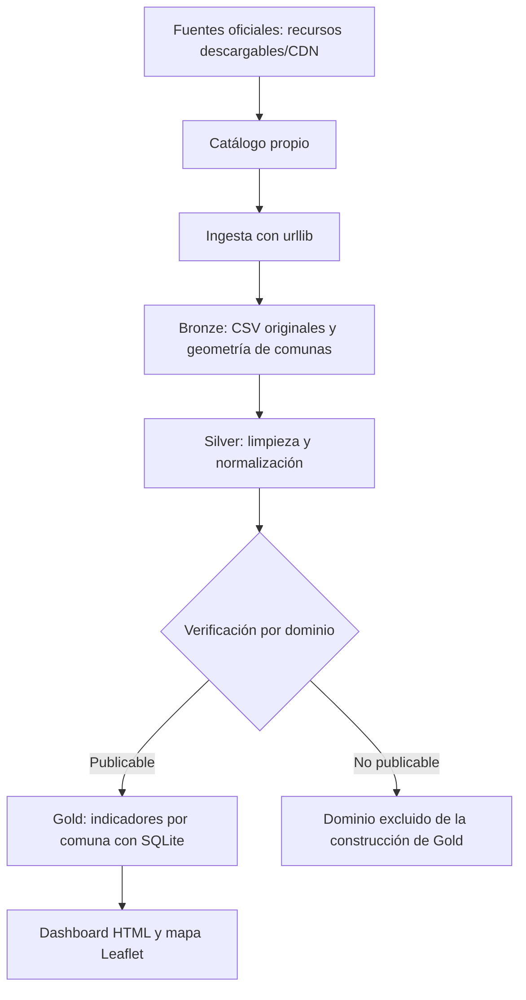

# 🧠 Cerebro Buenos Aires

Sistema de información urbana por comuna para la Ciudad Autónoma de Buenos Aires (CABA),
replicando tramo por tramo la arquitectura del ejemplo **Cerebro Lima**
(<https://cerebro-lima.vercel.app/>), como pide el taller de Gobernanza de Datos
(<https://gobernanzadatos.vercel.app/tallerdatos>).

> **🌐 Demo en vivo:** <https://cerebro-buenos-aires.vercel.app>
>
> Dashboard estático desplegado en Vercel, con **datos oficiales de Buenos Aires Data**
> y un mapa coroplético real por comuna.

> **Réplica, no copia.** Reconstruimos con nuestras manos un sistema que ya funciona,
> para entender por qué está hecho así. La ciudad elegida es **Buenos Aires** (Lima no vale,
> es el ejemplo).

## Pregunta que responde el sistema

> **¿Cómo cambia la disponibilidad de infraestructura y servicios urbanos entre las
> comunas de Buenos Aires?**

Indicadores por comuna:

- Estaciones de Ecobici por comuna
- Kilómetros de ciclovías por comuna
- Espacios verdes (cantidad y superficie) por comuna
- Hospitales por comuna (CeSAC no está incorporado como dominio independiente)

## Arquitectura (medallón: bronce → plata → oro)



| Capa | Archivos y comportamiento actuales |
|---|---|
| Bronze | `lago/raw/<dominio>/<fecha>.csv` y sidecars de ingesta. La geometría de comunas incluye un GeoJSON simplificado mediante `prep_comunas.py`. |
| Silver | CSV y Parquet por dominio. Los metadatos de procedencia están en `*.meta.json`, no en columnas adicionales. CSV se escribe siempre; Parquet requiere `pyarrow`. |
| Verificación | `lago/silver/_verificacion.json` determina qué dominios son publicables. |
| Gold | `build_gold.py` carga los CSV de SILVER en SQLite y genera indicadores CSV, `_meta.json` y la base local `cerebro.sqlite`. También copia `comunas.geojson` para el mapa. No genera Parquet en GOLD. |
| Consumo | `app/index.html` contiene el dashboard generado. DuckDB sobre SILVER Parquet y Streamlit son alternativas con scripts disponibles. |


Equivalencia con Cerebro Lima: `lago/raw` = **bronce**, `lago/silver` = **plata**,
`lago/gold` + vistas = **oro** (medallion architecture de Databricks).

## Herramientas exploradas por tramo

| Tramo | Herramienta A | Herramienta B | Estado / decisión actual |
|---|---|---|---|
| Descubrimiento | Catálogo propio | API CKAN | Catálogo propio + recursos descargables/CDN; CKAN bloqueado por WAF según las pruebas documentadas |
| Ingesta | `urllib` | `curl` | `urllib` ejecutado con datos oficiales; `curl` disponible sin comparación actual medida |
| Transformación | Python stdlib `csv` | Polars | stdlib ejecutado; Polars pendiente de evidencia comparativa sobre los mismos datos |
| Lago/formato | CSV | Parquet | Ambos formatos presentes en SILVER; la construcción actual de GOLD consume CSV mediante SQLite |
| Consulta | SQLite | DuckDB | SQLite ejecutado; DuckDB pendiente de evidencia comparativa |
| Lakehouse | DuckLake | Apache Iceberg | Scripts disponibles; pendiente acreditar ambas ejecuciones sobre los mismos datos. La demo SQLite de snapshots es histórica |
| Validación | Reglas propias | Pandera | Reglas propias ejecutadas; Pandera pendiente de evidencia actual |
| Vistas | HTML + Leaflet | Streamlit | HTML/Leaflet es la vista publicada; Streamlit está disponible como alternativa |
| Mapa | SVG coroplético | Leaflet | Leaflet implementado con fallback SVG; sin benchmark comparativo registrado |
| Despliegue | Archivo local | Vercel | Dashboard estático publicado en Vercel; sin comparación medida documentada |

> La bitácora (`bitacora/exploracion.md`) registra qué herramientas fueron ejecutadas,
> cuáles quedaron como alternativas y qué evidencia existe para cada decisión.
> La existencia de un script no demuestra su ejecución. El requisito de probar al
> menos dos herramientas sobre los mismos datos por tramo sigue parcialmente
> pendiente; no se presentan tiempos ni comparaciones que no estén registrados.

## Datos publicados oficiales y modo semilla explícito

El dashboard publicado usa **datos oficiales descargados de Buenos Aires Data**
(marcados `"_origen": "descarga"` en los metadatos). El pipeline soporta dos modos:

- **Ingesta real** (recomendado): `python scripts/run_pipeline.py --ingesta` baja los
  datasets vigentes desde BA Data y recalcula todos los indicadores.
- **Datos semilla** (offline): si no hay internet, `python scripts/run_pipeline.py`
  genera datos semilla realistas (`"_origen": "semilla_demo"`) que respetan la
  estructura de los datasets reales, para poder correr el pipeline de punta a punta
  sin conexión. El dashboard muestra un aviso cuando los datos son semilla.

Detalles de la ingesta real (verificados 2026-10):

- El portal CKAN (`data.buenosaires.gob.ar/api/...`) está detrás de un **WAF** que
  rechaza clientes programáticos. Por eso la ingesta usa el **CDN**
  (`cdn.buenosaires.gob.ar`) y el endpoint `/dataset/<slug>/resource/<uuid>/download`,
  con User-Agent de navegador (ver `scripts/fuentes.py` y `scripts/ingest_all.py`).
- Las **estaciones Ecobici** reales no traen el número de comuna: se **deriva por
  punto-en-polígono** (`scripts/geo.py`) cruzando lat/lon con el GeoJSON oficial de
  comunas — una unión espacial, pero con biblioteca estándar.

**Cero cifras sin fuente, sin vigencia o sin fecha de prueba.** Cada indicador se
rastrea hasta su archivo crudo y su huella SHA-256 (ver sección *Linaje* del dashboard).

## Cómo correr

### Requisitos

El **pipeline núcleo** (ingesta → silver → verify → gold → consulta SQLite →
dashboard HTML → lakehouse de bolsillo) corre **solo con la biblioteca estándar
de Python 3.9+**: no necesitas instalar nada.

Para habilitar las *herramientas B* documentadas (Parquet, Polars, DuckDB,
Pandera, Iceberg) y el dashboard interactivo de Streamlit:

```bash
python -m venv .venv
# Windows:        .venv\Scripts\activate
# Linux / macOS:  source .venv/bin/activate

pip install -r requirements.txt          # dependencias directas (versiones ==)
# o, para reproducir el entorno exacto probado:
pip install -r requirements.lock.txt
```

### Opción rápida: pipeline completo en un comando (recomendado)

```bash
python scripts/run_pipeline.py              # datos semilla (offline)
python scripts/run_pipeline.py --ingesta    # ingesta REAL desde BA Data (urllib)
python scripts/run_pipeline.py --curl       # ingesta REAL usando curl
```

`run_pipeline.py` es multiplataforma (Windows, Linux, macOS), usa el mismo
intérprete con el que lo invocás (respeta el `.venv`), corre los 9 tramos en
orden (incluye diccionario de datos y perfilado) y **se detiene en el primer fallo**.

### Opción manual: tramo por tramo

```bash
# 0) (opcional) Ingesta REAL desde BA Data — requiere internet
python scripts/ingest_all.py            # baja a lago/raw/  (o usa --curl)

# Si NO hay internet, generá datos semilla:
python scripts/_gen_seed.py

# 1) Limpieza  bronze -> silver
python scripts/transform_silver.py

# 1-bis) Gobernanza: diccionario de datos (catalogo/diccionario_datos.{json,md})
python scripts/diccionario.py

# 2) Verificación (si falla, no publica)
python scripts/verify.py

# 2-bis) Gobernanza: perfilado / completitud por columna (lago/silver/_perfilado.json)
python scripts/profile_silver.py

# 3) Indicadores  silver -> gold
python scripts/build_gold.py

# 4) Consultas de ejemplo (SQLite corrido; DuckDB documentado)
python scripts/query_sqlite.py

# 5) Lakehouse demo: versionado + time travel
python scripts/lakehouse_timetravel.py

# 6) Dashboard estático (regenera app/index.html con fecha + cifras actuales)
python scripts/build_dashboard.py
#    luego abrí app/index.html en el navegador

# 6-bis) Dashboard Streamlit (requiere streamlit instalado)
streamlit run app/streamlit_app.py
```

> **Nota de portabilidad (Windows):** los scripts imprimen caracteres Unicode
> (`✓`, `✗`, `·`, `m²`). Para evitar `UnicodeEncodeError` en consolas cp1252,
> cada script importa `scripts/_utf8.py`, que reconfigura la salida a UTF-8 de
> forma automática. No necesitás `set PYTHONUTF8=1` ni el flag `-X utf8`.

## Despliegue en Vercel

El dashboard (`app/index.html`) es un **sitio estático autocontenido** (datos horneados
en el HTML; Leaflet y los tiles del mapa se cargan por CDN). Se publica en Vercel sin
build. La configuración está en `vercel.json` (`outputDirectory: app`) y `.vercelignore`
(excluye `.venv`, datos crudos, scripts).

```bash
vercel login     # tu cuenta de Vercel (una sola vez)
vercel           # despliegue de preview (URL de prueba)
vercel --prod    # publica en producción
```

> Si el repositorio Git no es tuyo, el despliegue **directo desde la carpeta local**
> con la CLI funciona igual: Vercel sube los archivos de tu disco, sin depender de GitHub.
> Para actualizar el sitio luego de regenerar el dashboard, volvé a correr `vercel --prod`.

Demo publicada: <https://cerebro-buenos-aires.vercel.app>

## Estructura

```
cerebro-buenos-aires/
├── catalogo/           catalogo.csv  (inventario de fuentes)
│   ├── diccionario_datos.json  diccionario de datos (consumible por código)
│   └── diccionario_datos.md    diccionario de datos (legible)
├── scripts/            ingesta, transformación, verificación, gold, consultas, lakehouse
│   ├── run_pipeline.py orquestador multiplataforma (corre todo en orden)
│   ├── diccionario.py  gobernanza: genera el diccionario de datos
│   ├── profile_silver.py  gobernanza: perfilado/completitud por columna
│   ├── prep_comunas.py geometría real de comunas (descarga + simplifica RDP)
│   ├── geo.py          punto-en-polígono (deriva comuna de lat/lon)
│   └── _utf8.py        helper de portabilidad (salida UTF-8 en Windows)
├── lago/
│   ├── raw/            BRONZE (datos semilla / descargados)
│   ├── silver/         PLATA  (limpio, parquet/csv; + _perfilado.json)
│   └── gold/           ORO    (indicadores por comuna; _meta.json con linaje)
├── tests/              tests de reglas de validación
├── app/                dashboard (HTML estático + Streamlit)
├── bitacora/           exploracion.md  (justifica cada herramienta)
├── vercel.json         configuración de despliegue estático en Vercel
├── .vercelignore       exclusiones del deploy
├── requirements.txt    dependencias directas (versiones fijadas)
├── requirements.lock.txt  entorno exacto (pip freeze)
└── README.md
```

## Fuentes implementadas y referencias exploradas

- **Buenos Aires Data** — portal oficial CKAN de datos abiertos de CABA:
  <https://data.buenosaires.gob.ar/>
- **API CKAN de BA Data** (explorada; bloqueada por WAF, no utilizada en la ingesta vigente) — <https://data.buenosaires.gob.ar/api/3/action/package_search>
- **Datos Argentina** (referencia para futuras fuentes de población, no incorporada a GOLD) — <https://datos.gob.ar/>
- **INDEC** (referencia de contexto, no incorporada a GOLD) — <https://www.indec.gob.ar/> (contexto demográfico/socioeconómico)

Cada dataset concreto, con su URL y vigencia, está en `catalogo/catalogo.csv`.
